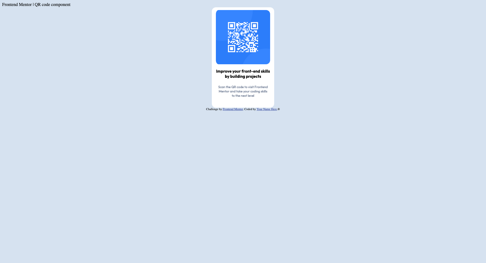

## Table of contents

- [Overview](#overview)
  - [Screenshot](#screenshot)
  - [Links](#links)
- [My process](#my-process)
  - [Built with](#built-with)
  - [What I learned](#what-i-learned)
  - [Continued development](#continued-development)
- [Author](#author)

**Note: Delete this note and update the table of contents based on what sections you keep.**

## Overview

This is a solution to the [QR code component challenge on Frontend Mentor](https://www.frontendmentor.io/challenges/qr-code-component-iux_sIO_H). Frontend Mentor challenges help you improve your coding skills by building realistic projects. 

### Screenshot



### Links

- Solution URL: [Add solution URL here](https://your-solution-url.com)
- Live Site URL: [Add live site URL here](https://your-live-site-url.com)

## My process
Firstly I started with HTML to add the content. I added an initial div to be container and then added another div inside to be the card that the image is over. I then added the image and began working on the css.

Admittedly the CSS is probably the part that I struggled with the most trying to get it as close to the design as possible and I definitely learned a few things that I will use going forward.

Once I had the image and the div aligned with the design I then focused on the H1 and P along with the custom font.

### Built with

- Semantic HTML5 markup
- CSS custom properties

### What I learned

The main thing I struggled with was making sure the design was responsive and making the div remain in the centre. From researching this I found this can be done by using margin: auto; in CSS.
```css
.proud-of-this-css {
  margin: auto;
}
```

### Continued development

After doing this challenge I definitely feel that I need to focus more on CSS for continued development.

## Author

Ross Kennedy!